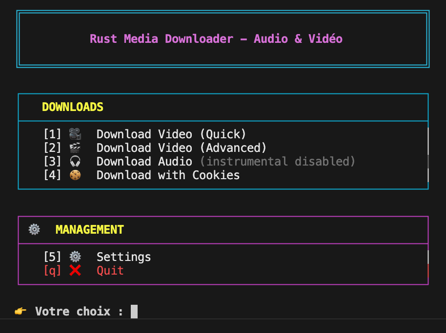

# Rust Media Downloader

**Rust Media Downloader** est un outil en ligne de commande (CLI) puissant, rapide et multiplateforme, écrit en **Rust**. Il permet de télécharger facilement des **vidéos** et des **audios** depuis diverses plateformes (YouTube, etc.) en utilisant `yt-dlp`.

Il propose deux modes d'utilisation :
1.  **Mode Interactif** : Un menu convivial pour vous guider.
2.  **Mode CLI** : Des commandes directes pour les scripts et les utilisateurs avancés.

> ✅ **Async & Rapide** (basé sur Tokio) – 🎵 **Extraction Instrumentale** (Spleeter) – 📦 **Multiplateforme**
 


---

## ✨ Fonctionnalités

*   **Téléchargement Vidéo** : Choix du format (mp4, webm, etc.) et de la qualité.
*   **Téléchargement Audio** : Extraction audio (mp3, wav, m4a, etc.).
*   **Extraction Instrumentale (IA)** : Séparation de la voix et de l'accompagnement via **Spleeter** (optionnel).
*   **Support des Cookies** : Pour télécharger du contenu restreint (via cookies navigateur).
*   **Mode Interactif** : Interface en ligne de commande avec menus (basé sur `dialoguer`).
*   **Mode CLI** : Arguments en ligne de commande pour l'automatisation.
*   **Cross-Platform** : Compatible Linux, macOS et Windows.

---

## ⚙️ Prérequis

Pour fonctionner correctement, cet outil nécessite :

1.  **[yt-dlp](https://github.com/yt-dlp/yt-dlp)** : Le moteur de téléchargement principal. Doit être installé et accessible dans le `PATH`.
2.  **[ffmpeg](https://ffmpeg.org/)** : Requis pour la conversion et la fusion audio/vidéo.
3.  **[Spleeter](https://github.com/deezer/spleeter)** (Optionnel) : Requis uniquement si vous souhaitez utiliser l'extraction instrumentale.

---

## 🚀 Installation

### Binaires pré-compilés

Téléchargez la dernière version depuis les [Releases GitHub](https://github.com/teamflp/rust-downloader/releases/latest).

### Compilation manuelle

Si vous avez [Rust](https://www.rust-lang.org/) installé :

```bash
git clone https://github.com/teamflp/rust-downloader.git
cd rust-downloader
cargo build --release
```

Le binaire se trouvera dans `target/release/rmd`. Vous pouvez le déplacer où vous voulez ou l'ajouter à votre `PATH`.

---

## 📖 Utilisation

Il existe plusieurs façons d'utiliser l'application.

### 1. Script de facilité (Recommandé)

Un script `./rmd` est fourni pour simplifier l'utilisation.

**Mode Interactif :**
```bash
./rmd
```

**Mode CLI (Téléchargement direct) :**
```bash
./rmd "https://youtu.be/..."
```

### 2. Via Cargo (Développement)

Si vous avez Rust installé, vous pouvez lancer l'application directement.

**Mode Interactif :**
```bash
cargo run
```

**Mode CLI :**
⚠️ **Important :** Utilisez `--` pour séparer les arguments de cargo de ceux de l'application.

```bash
cargo run -- "https://youtu.be/..."
```

### 3. Binaire (Production)

Pour une utilisation optimale (plus rapide), compilez le projet.

**Compilation :**
```bash
cargo build --release
```

Le binaire sera créé dans `target/release/rmd`.

**Exécution :**
```bash
# Mode interactif
./target/release/rmd

# Mode CLI
./target/release/rmd "https://youtu.be/..."
```

---

## ⚠️ Dépannage & Erreurs Courantes

### "zsh: no matches found"
Si vous obtenez cette erreur, c'est que votre terminal essaie d'interpréter les caractères spéciaux (`?`, `&`) dans l'URL.
**Solution :** Mettez toujours l'URL entre guillemets.
*   ❌ `rmd https://youtu.be/video?t=1`
*   ✅ `rmd "https://youtu.be/video?t=1"`

### "command not found: rmd"
Si vous essayez de lancer `rmd` et obtenez cette erreur, c'est que le système ne trouve pas l'exécutable.
**Solution :**
*   Si vous utilisez le script ou le binaire dans le dossier courant, ajoutez `./` devant : `./rmd`.
*   Ou ajoutez le dossier à votre `PATH`.

---

## 📋 Exemples de Commandes (CLI)

Ces exemples fonctionnent avec le script `./rmd`. Si vous utilisez `cargo run`, remplacez `./rmd` par `cargo run --`.

*   **Télécharger une vidéo (meilleure qualité) :**
    ```bash
    ./rmd "https://youtu.be/example"
    ```

*   **Télécharger en MP4 :**
    ```bash
    ./rmd --format mp4 "https://youtu.be/example"
    ```

*   **Télécharger l'audio (MP3) :**
    ```bash
    ./rmd --audio --format mp3 "https://youtu.be/example"
    ```

*   **Télécharger l'audio et extraire l'instrumental (Spleeter) :**
    ```bash
    ./rmd --audio --instrumental "https://youtu.be/example"
    ```

---

## 🛠️ Configuration

L'application crée un fichier de configuration `config.toml` (généralement dans `~/.config/rust-media-downloader/` ou `%APPDATA%` sous Windows) pour sauvegarder vos préférences (dossier de téléchargement, format par défaut, etc.).

Vous pouvez modifier ces paramètres via le menu **Settings** du mode interactif.

---

## 🤝 Contribution

Les contributions sont bienvenues ! N'hésitez pas à ouvrir une Issue ou une Pull Request.

1.  Forkez le projet
2.  Créez votre branche (`git checkout -b feature/AmazingFeature`)
3.  Committez vos changements (`git commit -m 'Add some AmazingFeature'`)
4.  Poussez vers la branche (`git push origin feature/AmazingFeature`)
5.  Ouvrez une Pull Request

---

## 👤 Auteur

[Paterne G. G](https://github.com/teamflp) – Passionné de Rust & d'efficacité.

## 📄 Licence

MIT – Faites-en bon usage !